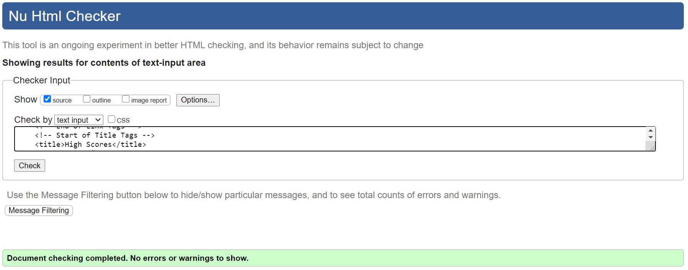
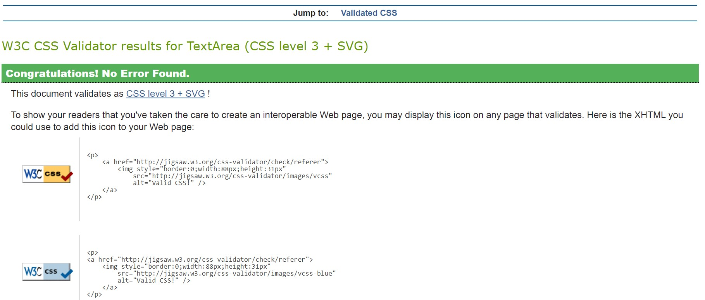
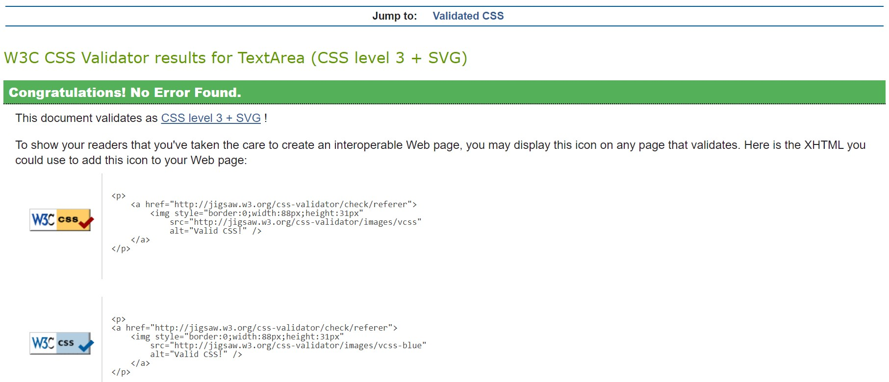

## Testing

### HTML5

I ran all the HTML code into [W3C Markup Validator](https://validator.w3.org/). Out of five pages there were no
errors. However there were two pages that had a warning for an empty heading. As javascript is implemented for
this project these two warnings can be ignored because when these pages load javascript will then populate
the heading. This is why it is left empty.

#### index.html

    - No errors or warnings.

#### cigargame.html

    - No errors but a warning for an empty heading. But javascript will populate the page when 
    loaded.

#### cigarquiz.html

    - No errors or warnings.

#### end.html

    - No errors but a warning for an empty heading. But javascript will populate the page when 
    loaded.

#### highscores.html

    - No errors or warnings.

---

### CSS

All style sheets were validated on [W3C CSS Validator](https://jigsaw.w3.org/css-validator/).
No errors came up for any of CSS file. There were two files that came up with a warning in 
regards to Google fonts CSS and ran that file through the validator that also came up with 
no errors.

#### app.css

#### cigargame.css

#### googlefonts.css

#### highscores.css

#### style.css

---

### Javascript

Running all the javascript code through [JSHint](https://jshint.com/) there were no errors. 
There were some warnings on the cigargame.js file but it was only because the code is written in 
ES6. I further tested the viability of the javascript code by getting the target audience to 
visit the website and play the quiz. All came back that the website loaded well and the quiz
populated the questions from the javascript.

#### cigargame.js

#### emailjs

#### end.js

#### map.js

#### scripts.js

---

## Responsive

The responsiveness of this website was tested using [Am I Responsive](http://ami.responsivedesign.is/#).

---

#### Header Section

The header is the sticky navigation bar which consists of the logo on the left and the six 
website sections. All sections were tested through clicking to get to the specified sections
and the logo is clicked to navigate back to the top of the page.

#### index.html Section

This is the single scrolling page which a user can navigate through the main part of the website
by either scrolling or using the navigation bar. I tested through both scrolling and using the
navigation bar with no problems. As all the sections are essentially on this one page I 
individually scrolled and clicked on the navigation bar to land on the section. 

On the Cigar Globe section the 
[Google Maps API](https://developers.google.com/maps/documentation/javascript/overview) loads 
well and shows the marker cluster. The text on this section allows users to hover over each 
factory name and click to show the user where the factory is and is identified with 
a letter corresponding to the letter next to the factory name.

Cigar Journey section is created with the 
[bootstrap accordion](https://getbootstrap.com/docs/4.3/components/collapse/#accordion-example). 
Each tab is clicked to show the next section and the last will collapse. The images were also 
tested for loading with no problems. The buttons too will highlight as the user hovers over each.
At the Cigar Talk section there is an alphabetical navigation list that is created through
[jQuery](https://jquery.com/). Each letter highlights when a user hovers over. Each click on a 
different letter will the show all the definitions for that letter. On load the A section is 
already loaded for the user to see.

On the Cigar Quiz section is the few times a user will navigate out of the main page. The quiz is 
created with [Javascript](https://www.javascript.com/). The button to go to the quiz highlights
and allows the user to click to the quiz.

The final section of the main page is the Contact section. It is a form with three fields. Name,
email and message. All fields are required before a user can send the message. 
[EmailJS API](https://www.emailjs.com/) is used to allow the user to contact the client. This 
too is tested and the email sends to the client seamlessly.

#### Cigar Quiz Section

When the user lands onto the Cigar Quiz section there is the logo which when clicked takes the
user back to the Home section. There are two additional buttons of Play and Highscores. These
buttons have box shadowing when the mouse hovers over. The Play button clicks through to the 
cigar quiz window and the Highscores takes the user to the Highscores list window.

#### Play Section

On the play screen there is a progress bar and score HUD which populates as the users progress.
The questions are randomly generated from the JSON file. There are four multiple choice 
answers a user can choose and when hovered over the each box is highlighted with box shadowing.
When a user clicks on a choice the box will either highlight green if correct or red when it is
wrong.

#### End Section

Once the game is finished the user is taken to the end section where there are a few choices.
The user can enter their name and save the score to their local storage so that they can always
see the score. They cannot save unless a name has been inputted. Once the save button is clicked
the user will be sent to the High Scores page.
They can also play again which will navigate them back to the quiz page. Or they can go home 
through the Go Home button or click the logo at the top of the page.

#### Highscores

This page will only show the top scores set by the user if the sixth score is higher than the
five on the page then the lowest score on the list is replaced. Again the user is given the 
choice of two buttons. Play Again will allow the user to navigate back to the quiz page or
Go Home to get back to the Home section of the website. They can also achieve this by clicking
the logo at the top.

#### Footer Section

The footer has the websites contact details and three social media icons. 
[Facebook](https://www.facebook.com/), [Instagram](https://www.instagram.com/) and 
[Twitter](https://twitter.com/) were tested to see if when these icons are clicked it navigates 
away to the respective page and opens on a new page so the user can get back to our site.

---

### Browser Test

|      Browser      | Good | Bad |
|:-----------------:|:----:|:---:|
|   Google Chrome   |   X  |     |
|      Firefox      |   X  |     |
|       Opera       |   X  |     |
|       Safari      |   X  |     |
|        Edge       |   X  |     |
| Internet Explorer |      |  X  |

In Internet Explorer the main part of the site is working well however the cigar quiz doesn't
populate the javascript code. This is because Internet Explorer is becoming very outdated and
the people that are still using IE browser is not the target audience the client is aiming for.

### Device Test

|    Device    | Good | Bad |
|:------------:|:----:|:---:|
|   Galaxy S5  |   X  |     |
|    Pixel 2   |   X  |     |
|  iPhone 5/SE |   X  |     |
| iPhone 6/7/8 |   X  |     |
|   iPhone X   |   X  |     |
|     iPad     |   X  |     |
|   iPad Pro   |   X  |     |
|  Surface Duo |   X  |     |
